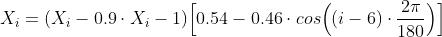
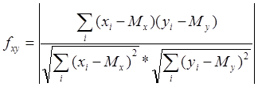

## Идентификация по голосу

При распознавании образца проводится процесс, первым шагом
которого является первоначальное трансформирование вводимой
информации для сокращения обрабатываемого объема так, чтобы
ее можно было бы подвергнуть анализу. Следующим этапом является
спектральное представление речи, получившееся путем
преобразования Фурье. Спектральное представление достигнуто
путем использования широко-частотного анализа записи.

Хотя спектральное представление речи очень полезно, необходимо помнить, что изучаемый сигнал весьма разнообразен.
Разнообразие возникает по многим причинам, включая:

* различия человеческих голосов
* уровень речи говорящего
* вариации в произношении
* нормальное варьирование движения артикуляторов (языка, губ, челюсти, нёба)

Затем определяются конечные выходные параметры для варьирования
голоса и производится нормализация для составления шкалы
параметров, а также для определения ситуационного уровня речи.
Вышеописанные измененные параметры используются затем для
создания шаблона. Шаблон включается в словарь, который
характеризует произнесение звуков при передаче информации
говорящим, использующим эту систему. Далее в процессе
распознавания новых речевых образцов (уже подвергшихся
нормализации и получивших свои параметры), эти образцы
сравниваются с шаблонами, уже имеющимися в базе, используя
динамичное искажение и похожие метрические измерения.

#### Процесс сравнивания образцов состоит из следующих стадий:
1. фильтрация шумов
2. спектральное преобразование сигнала
3. постфильтрация спектра
4. лифтеринг
5. наложение окна Кайзера
6. сравнение

---
## Фильтрация шумов
Чтобы получить четкие спектральные характеристики звука,
их нужно отчистить от лишних шумов.
Входной дискретный звуковой сигнал обрабатывается фильтрами,
для того чтобы избавится от помех возникающих при записи по формуле:

После обработки в сигнале ищется начало и конец записи,
а так как шумы уже отфильтрованы, то начало фрагмента будет
характеризоваться всплеском сигнала, если искать с Х0.
Соответственно если искать с Хn вниз, то всплеск будет
характеризовать конец фрагмента. Таким образом получим начала
и конца фрагмента в массиве дискретных значений сигнала. 

Помимо высоты тона человек ощущает и другую характеристику
звука — _громкость_. Физические величины, наиболее точно
соответствующие громкости, — это шоковое давление (для
звуков в воздухе) и амплитуда (для цифрового или электронного
представления звука).

Если говорить об оцифрованном сигнале, то амплитуда — 
это значение выборки. Анализируя миллионы дискретных значений
уровня одного и того же звука, можно сказать о пиковой амплитуде,
то есть об абсолютной величине максимального из полученных
дискретных значений уровня звука. Чтобы избежать искажения,
вызванного искажением ограничения сигнала при цифровой записи
звука (данное искажение возникает в том случае, если величина
пиковой амплитуды выходит за границы, определяемые форматом
хранения данных), необходимо обратить внимание на величину пиковой
амплитуды. При этом нужно сохранять отношение сигнал/шум на
максимально достижимом уровне.

Основной причиной разной громкости звуков является различное давление,
оказываемое ими на уши. Можно сказать, что волны давления обладают
различными уровнями мощности. Волны, несущие большую мощность,
с большей силой оказывают воздействие на механизм ушей. 
Электрические сигналы, идущие по проводам, также передают мощность.
По проводам звук обычно передается в виде переменного напряжения, 
и мгновенная мощность этого звука пропорциональна квадрату напряжения.
Чтобы определить полную мощность за период времени, необходимо
просуммировать все значения моментальной мощности за этот период.

Поскольку мы используем звук, представленный дискретными значениями,
достаточно просто сложить квадраты отсчетов. Среднее значение квадратов
дискретных значений пропорционально средней мощности.

---
## Спектральное преобразование сигнала

Поскольку любой звук раскладывается на синусоидальные волны, мы
можем построить частотный спектр звука.

Основная идея быстрого преобразования Фурье заключается в том,
что каждую вторую выборку можно использовать для получения
половинного спектра. Формально это означает, что формула 
дискретного преобразования Фурье может быть представлена в виде
двух сумм. Первая содержит все четные компоненты оригинала, 
вторая — все нечетные.

---
## Фильтрация спектра
Получив спектральное представление сигнала его требуется отчистить
от шумов. Человеческий голос обладает известными характеристиками,
и поэтому те области которые не могут являются характеристиками
голоса нужно погасить. Для этого применим функцию, которая получила
название "окно Кайзера"

После фильтрации спектра наложим окно Ханнинга.

---
## Сравнение с эталонными образцами в базе
Основным параметром, используемым для идентификации, является
мера сходства двух звуковых фрагментов. Для ее вычисления 
необходимо сравнить спектрограммы этих фрагментов. При этом 
сначала сравниваются спектры, полученные в отдельном окне, 
а затем вычисленные значения усредняются.

Для сравнения двух фрагментов использовался следующий подход:
Предположим что X[1..N] и Y[1..N] массивы чисел, одинакового
размера N, содержащие значения спектральной мощности первого
и второго фрагментов соответственно. Тогда мера сходства между
ними вычисляется по следующей формуле:

где Mx и My математические ожидания для массивов X[] и Y[] соответственно

Данный способ вычисления меры сходства двух фрагментов представленных
в виде спектра является самым оптимальным для задачи идентификации
человека по его голосу.

* http://www.jip.ru/2020/10-21-2020.pdf
* https://habr.com/ru/post/336516/
* http://www.jip.ru/2010/87-104-2010.pdf
* https://habr.com/ru/post/144580/
* https://medium.com/nuances-of-programming/анализ-аудиоданных-с-помощью-глубокого-обучения-и-python-часть-1-2056fef8525e
* https://xakep.ru/2019/09/03/voice-recognition/
